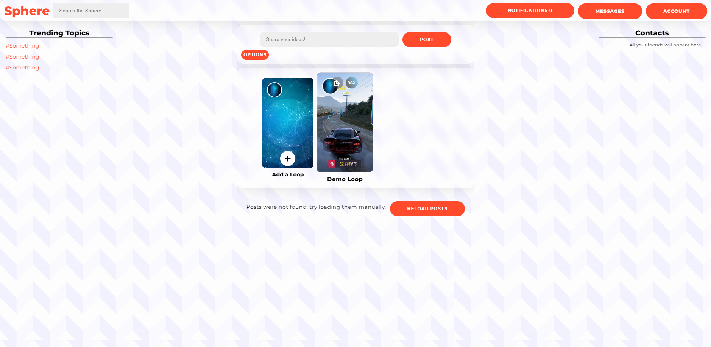

# Sphere
 
> Sphere is an open-source social network developed with Spring Boot and React, built on a microservices architecture for scalability and modularity. Currently, the project is still under development, and I am continuously enhancing it by adding new features. This is my primary project, where I plan to focus my efforts on delivering ongoing improvements, aiming to make it a robust and innovative platform.

# Features
<ul>
  <li>Authentication with Oauth2 Authorization Server</li>
  <li>Eureka</li>
  <li>Gateway Server</li>
  <li>RabbitMQ</li>
  <li>Friendship Invitation</li>
  <li>Private Chat</li>
  <li>Post's</li>
  <li>Sharing daily videos to friends</li>
</ul>

# Microservices

  

    <dt><strong>chat-server</strong></dt>
    <dd>Designed to centralize the communication logic between users within our ecosystem of applications. It manages all chat and messaging interactions, ensuring a fast, secure, and reliable communication experience.</dd>
    

    <dt><strong>eureka-server</strong></dt>
    <dd>Eureka Server is an essential solution within the Spring Cloud toolset, designed to facilitate service registration and discovery in a microservices architecture. Developed by Netflix as part of the Netflix OSS project, Eureka Server offers an efficient and reliable way to manage communication between distributed services.</dd>
    

    <dt><strong>gateway-server</strong></dt>
    <dd>The Gateway Server is a central and indispensable component in a microservices architecture, acting as the entry point for all requests coming into the system. It provides a unified access point for clients, efficiently and securely routing requests to the appropriate services.</dd>
    

    <dt><strong>video-server</strong></dt>
    <dd>The Video Server is an essential microservice within your application's ecosystem, designed to store and manage all media, including photos and videos. It not only stores this media securely and efficiently but also performs the necessary processing to optimize the delivery and consumption of videos on the frontend.</dd>
    

  

  

    <dt><strong>notification-server</strong></dt>
    <dd>The Notification Server is an essential microservice designed to centralize and manage all notifications within an application ecosystem. It ensures that notifications are distributed efficiently and in real-time to users, utilizing integration with RabbitMQ for robust and reliable communication.</dd>
    

    <dt><strong>oauth-server</strong></dt>
    <dd>The OAuth Server is an essential microservice that implements the OAuth2 Authorization Server protocol, providing a robust and secure mechanism for authentication and authorization of users and applications within a microservices ecosystem. It plays a crucial role in protecting sensitive resources and managing permissions, ensuring that only authenticated users and applications can access the necessary resources.</dd>
    

    <dt><strong>post-server</strong></dt>
    <dd>The Post Server is an essential microservice that centralizes the management of posts within your application's ecosystem. It is designed to handle all operations related to posts, ensuring efficient, secure, and scalable management of user-generated content.</dd>
    <dt><strong>publisher-server</strong></dt>
    

    <dd>Publisher-MS is a vital microservice within your application's ecosystem, designed to act as an efficient and reliable intermediary for requests, directing these requests to the appropriate RabbitMQ queues. This service ensures that messages are correctly routed to other microservices, facilitating asynchronous communication and smooth integration between different system components.</dd>
  

 

> In a microservices ecosystem, modularity and component reuse are fundamental to the efficiency and maintainability of applications. To meet specific needs and provide additional support, auxiliary services are used to encapsulate common logic and reusable functionalities. Here are some of the main auxiliary services:

> Sphere-Properties is an auxiliary service dedicated to managing application-specific configurations. It centralizes the access logic and manipulation of properties defined in the application.yml file, allowing different microservices to share and use these configurations consistently and securely.

> Sphere-Websockets is an auxiliary service that facilitates the implementation and management of WebSockets in applications, allowing real-time bidirectional communication between client and server. It provides session logic and the necessary configurations to integrate WebSockets into the main application.

> Utils is a set of utilities that provides common and reusable functionalities for the main application. It includes classes and methods that are frequently used in different parts of the application, such as mappers, Data Transfer Objects (DTOs), and other utilities.

# Project Images

</img> </img> </img> </img> </img> </img>

 
📝 Observations

To stay updated on the latest features and improvements in the Sphere project, follow my LinkedIn profile, where I’ll be sharing updates as they are released.

FFMPEG Example:
ffmpeg -i input_video.mp4 -codec copy -hls_time 10 -hls_list_size 0 -f hls output_playlist.m3u8

## 🤝 Developers
<table>
  <tr>
    <td align="center">
         
        
          <b>Emanuel Silva de Moraes Castro</b>
        
    </td>
  </tr>
</table>